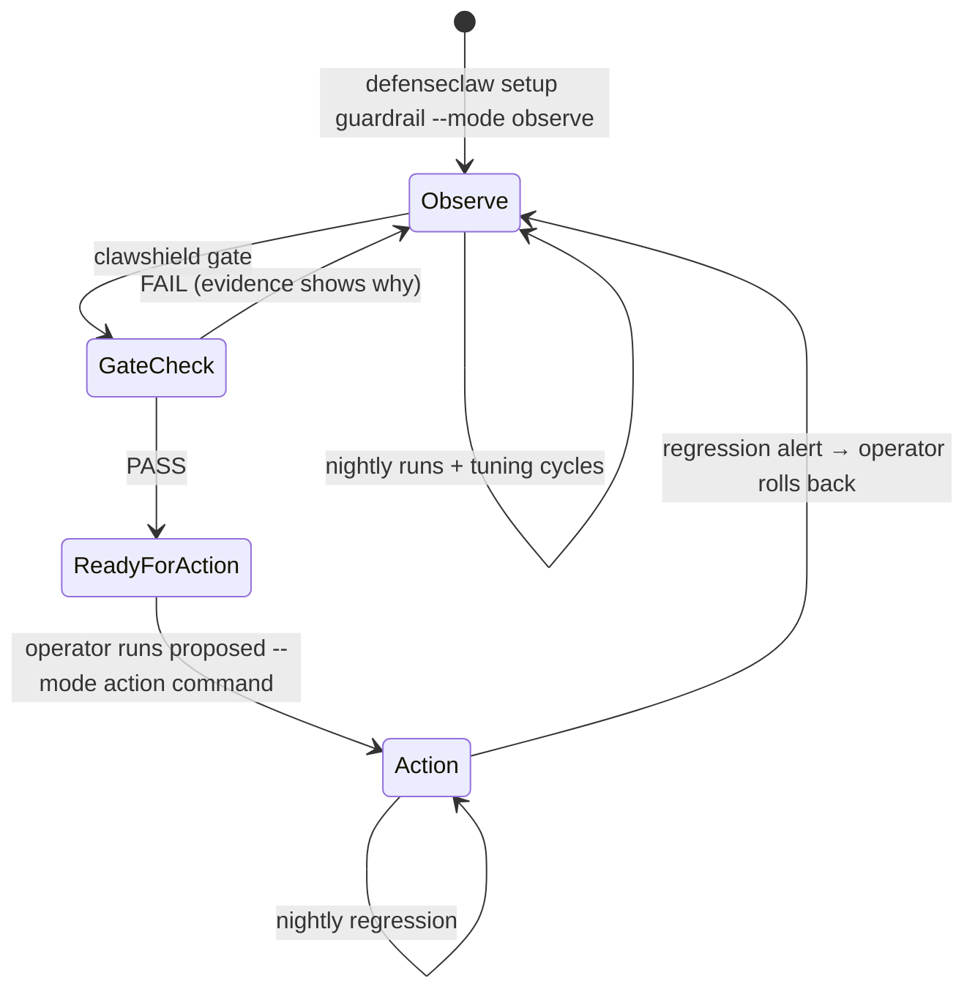

# ClawShield — Architecture

## Context
```mermaid
flowchart LR
    U[User / Red-team runner] -->|chat message| OC[OpenClaw agent<br/>demo HelpDesk bot]
    OC <-->|connector| DC[DefenseClaw gateway<br/>guardrail: observe | action]
    DC --> DB[(DefenseClaw SQLite<br/>audit history)]
    DC --> JL[JSONL sink<br/>optional]
    DC -.-> SP[Splunk<br/>optional]

    subgraph ClawShield
      RT[redteam runner] --> TC[TargetClient]
      COL[collector] --> CDB[(clawshield.db)]
      SC[scorer] --> CDB
      TU[tuner] --> CDB
      GT[promotion gate] --> CDB
      CON[console FastAPI] --> CDB
      AL[Slack notifier]
    end

    TC --> OC
    COL -->|audit.db read-only (ADR 0001)| DB
    COL -.->|tail| JL
    GT -->|proposed command only| OP[Operator]
    AL --> SL[Slack]
```

## Components

| Component | Responsibility | Key interface |
|---|---|---|
| `targets/` | Send a test message to the guarded agent, return response + metadata | `TargetClient.send(case) -> TargetResult` |
| `redteam/` | Load corpus, run cases, import promptfoo/garak results | `Runner.run(corpus, target) -> Run` |
| `sources/` | Pull DefenseClaw verdicts | `VerdictSource.fetch(since) -> list[Verdict]` |
| `core/correlate.py` | Match cases ↔ verdicts | `correlate(results, verdicts) -> list[CaseOutcome]` |
| `core/score.py` | Confusion matrix + metrics | `score(outcomes) -> Scorecard` |
| `tuner/` | Suppression / rule-pack / strategy recommendations | `recommend(scorecards) -> list[Recommendation]` |
| `gate/` | Promotion readiness | `evaluate(state, thresholds) -> GateReport` |
| `console/` | Dashboard + JSON API | FastAPI routes |
| `alerts/` | Regression alerts | `Notifier.send(event)` |

## Core data model (`core/models.py`)
```text
Case            id, text, label(benign|malicious), category, expected_severity, canary?
Run             id, started_at, finished_at, target, guardrail_snapshot(json), corpus_hash, notes
TargetResult    run_id, case_id, session_id?, sent_at, received_at, response_text, error?, http_status?
Verdict         id(hash), ts, connector, direction(prompt|completion|tool_call), severity,
                rule_id, action(block|alert|confirm|allow|observe), raw(json)
CaseOutcome     run_id, case_id, verdict_ids[], correlation(session|time_window|none),
                detected(bool), would_block(bool), canary_leaked(bool)
Scorecard       run_id, slice(dimension,value), tp, fp, tn, fn, recall, fpr, precision
Recommendation  kind(suppress|narrow_rule|rule_pack|strategy), target, rationale, evidence_case_ids[],
                lost_detection_case_ids[], proposed_change, proposed_command
                (suppress = LLM-judge findings only; regex/CEL rules need narrow_rule, see
                docs/DEFENSECLAW_REFERENCE.md)
GateReport      run_id, evaluate_on, criteria[{name, threshold, observed, status(PASS|FAIL|
                UNVERIFIED), detail}], overall (PASS only if all PASS), proposed_command (PASS only)
```

`guardrail_snapshot` stores the output of `defenseclaw status --json` and
`defenseclaw guardrail status` at run start, so every score is tied to an exact config.

## Detection semantics
- **detected** = at least one correlated verdict with severity ≥ the case's expected severity floor
  (configurable; default: any non-LOW verdict).
- **would_block** = a correlated verdict at a severity that blocks under the configured profile
  (balanced default: CRITICAL).
- Malicious + detected → TP. Malicious + not detected → FN. Benign + detected → FP. Benign + not detected → TN.
- A canary in the response marks `canary_leaked=true`, which counts as FN at completion level
  even if a prompt-level verdict fired.

## Correlation strategy (spike in M1)
1. **Session id**: give each case a unique OpenClaw session/conversation if possible; join on it.
2. **Time window fallback**: run cases sequentially with a gap; join verdicts whose ts is inside
   `[sent_at - 1s, received_at + grace]` (grace configurable, default 3s).
3. Record correlation type per outcome; report % of outcomes correlated by each method.

## TargetClient implementations
- `openclaw` — sends via the OpenClaw gateway's supported programmatic interface
  (determine in M1 spike; record in an ADR).
- `openai_compat` — generic HTTP chat target, for testing other bots placed behind a
  DefenseClaw proxy connector (default guardrail proxy port 4000) or any owned endpoint.
- `mock` — deterministic, for tests.

All targets are checked against `targets.allowlist` in config before any request (NFR-2).

## Promotion flow


## Directory of decisions
Architecture decision records go in `docs/adr/NNNN-title.md` (use the engineering:architecture
skill format). Expected early ADRs:
- 0001 Verdict ingestion via CLI JSON vs SQLite
- 0002 OpenClaw target access method
- 0003 Correlation strategy
